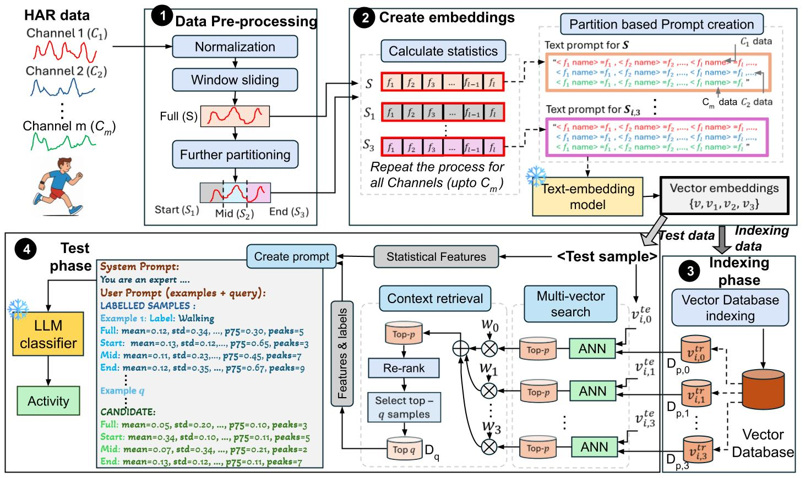

  

**Abstract.** Human Activity Recognition (HAR) underpins applications in healthcare, rehabilitation, fitness tracking, and smart environments, yet existing deep learning approaches demand dataset-specific training, large labeled corpora, and significant computational resources. We introduce RAG-HAR, a training-free retrieval-augmented framework that leverages large language models (LLMs) for HAR. RAG-HAR computes lightweight statistical descriptors, retrieves semantically similar samples from a vector database, and uses this contextual evidence to make LLM-based activity identification. We further enhance RAG-HAR by first applying prompt optimization and incorporating domain knowledge to effectively guide LLMs, and second, by introducing an LLM-based activity descriptor that generates context-enriched vector databases for delivering accurate and highly relevant contextual information. Along with these mechanisms, RAG-HAR achieves state-of-the-art performance across six diverse HAR benchmarks. Most importantly, RAG-HAR attains these improvements without requiring model training or fine-tuning, emphasizing its robustness and practical applicability.
